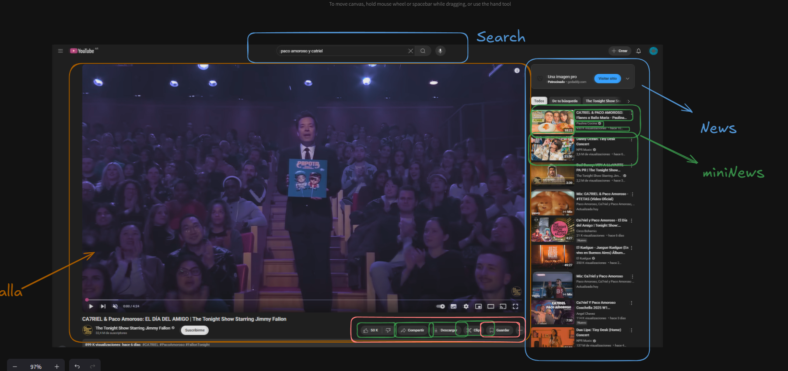

challenge replicar esto en react desde lo mas basico!


```bash
# Estructura aprox este proyecto o incluso podriamos usar por componentes mayores usar la tecnica de container presentacion

/src
  /components
    SearchBar.jsx
    VideoPlayer.jsx
    PlayerControls.jsx
    SidebarNews.jsx
    MiniNewsCard.jsx
  App.jsx
  index.jsx


```


Analisis del schema wireframe: 
# 🎥 Interfaz de YouTube - Wireframe UI

```plaintext
┌────────────────────────────────────────────────────────────┐
│ 🔍 Buscar...                                        [btn]  │ ← SearchBar
├────────────────────────────────────────────────────────────┤
│ ┌────────────────────────────┐   ┌──────────────────────┐  │
│ │                            │   │  📰 News Sidebar      │  │
│ │      📺 Video Player       │   │ ┌────────┐ Título 1  │  │
│ │   (YouTube Embed Frame)    │   │ │ Thumb  │ Título 2  │  │
│ │                            │   │ │ Thumb  │ Título 3  │  │
│ └────────────────────────────┘   │ │  ...   │   ...     │  │
│ ┌────────────────────────────┐   └──────────────────────┘  │
│ │⏪ 10s  | 📤 Compartir | ⏬ DL | 💾 Guardar               │ ← Controles
│ └────────────────────────────┘                            │
└────────────────────────────────────────────────────────────┘
```

## 🧱 Componentes involucrados

- `SearchBar` → input + botón
- `VideoPlayer` → embed del video principal
- `PlayerControls` → botones: retroceder, compartir, descargar, guardar
- `SidebarNews` → lista de mini-cards
  - `MiniNewsCard` → thumbnail + título

---

```js

// Data que utilizaria como data del tipo mockup
export const mockData = {
  video: {
    id: "abc123",
    title: "C4ZT1EL & Paco - Anniversary Highlight",
    url: "https://www.youtube.com/embed/dQw4w9WgXcQ", // temporal
    likes: 12456
  },
  relatedNews: [
    {
      id: "1",
      title: "C4ZT1EL y Paco revientan la liga",
      thumbnail: "https://via.placeholder.com/150x100?text=1"
    },
    {
      id: "2",
      title: "Jimmy sorprende con su nuevo truco",
      thumbnail: "https://via.placeholder.com/150x100?text=2"
    },
    {
      id: "3",
      title: "Lo que nadie esperaba del torneo",
      thumbnail: "https://via.placeholder.com/150x100?text=3"
    },
    {
      id: "4",
      title: "La final más vista del año",
      thumbnail: "https://via.placeholder.com/150x100?text=4"
    }
  ]
};

```